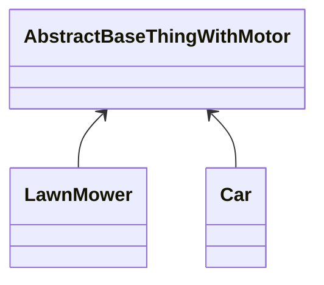
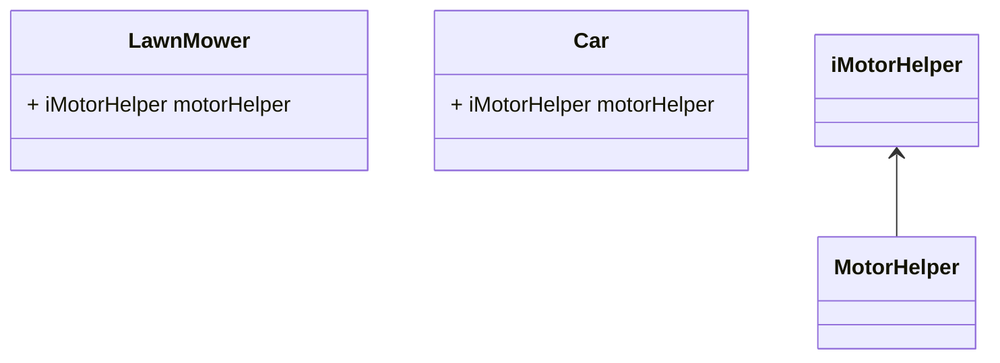

If you have different interfaces for the child classes, but you are using the abstract class to factor out duplication within objects, then your abstract class is working as a base class.

See if this functionality can be moved to a concrete helper class instead.

## References

[Nigel Thorne's answer to How to Unit Test Abstract Classes?](https://stackoverflow.com/a/2947823/14318926)
