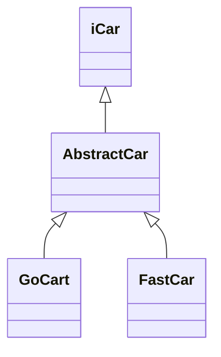
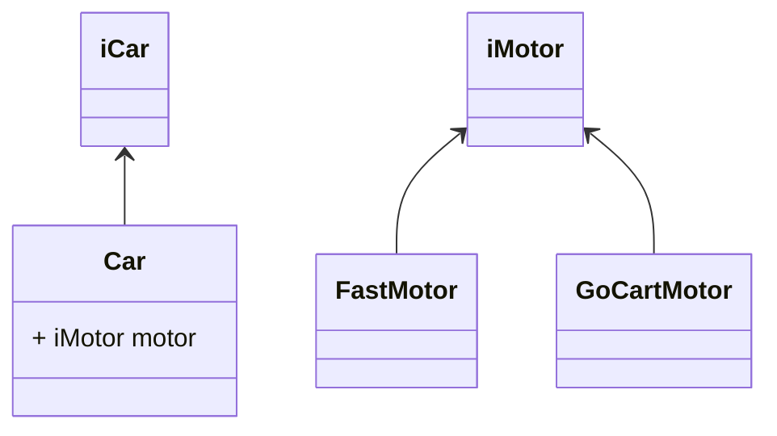

If there is a common interface for all concrete implmentations of your abstract class, it means you are just using [[paradigm.oo.pillars.inheritance]] to define/change certain behaviour of the class.

You should rather prefer [[arch.design.oo.principles.composition over inheritance]].

Just turn your abstract class into a concrete implementation and inject the "behaviour" which you are trying to change from outside using [[arch.design.oo.patterns.gof.behavioural.strategy]].

## References

[Nigel Thorne's answer to How to Unit Test Abstract Classes?](https://stackoverflow.com/a/2947823/14318926)
