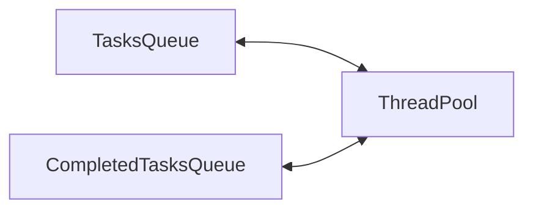

aka **Replicated Workers** or **Worker-crew** model.

## Problem

- Frequent creation and destruction of threads for short-lived tasks can be expensive.

## Solution

- Maintain multiple threads waiting for a task to be assigned.
- Queue the tasks and assign them to worker threads
- Add tasks to completed tasks queue.

## Benefits

- Thread creation-destruction overhead is contained to initial creation of the pool => may result in better performance and stability

## Optimal Pool Size

- Threads consume memory
- Context-switching also takes time

=> If the number of threads are excess, the above two will lead to memory wastage and performance penalties.

- Thread creation + more threads = cost of creating unused threads
- Thread creation + less threads = longer waiting time
- Thread destruction + more threads = cost of creating them again later
- Thread destruction + less threads = May starve other processes of resources (more unused threads in memory)

Thus, the pool size has to be very carefully tuned to a sweet-spot. This can be dynamically determined during the application's lifecycle based on the number of waiting tasks. 

