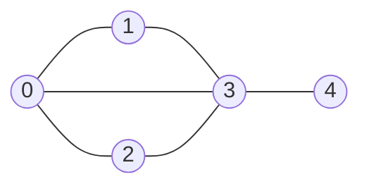

Network that help define and visualise relationships between various components.

More formally -

A graph $G = (V, E)$ is a set of vertices $V$ and edges $E$.
    where each edge $(u,v)$ is a connection between vertices. $u, v \in V$.

- Edge is usually represented as a pair of vertices.
- Vertices are also referred to as nodes.
- Mathematically, graphs are represented using Set notation.

$E = \{(0,1), (0,2), (0,3), (1,3), (2,3), (3,4)\}$

## Some Graph Terminology

- **Neighbours**: Directly connected nodes.
- **Degree** of a node: Number of neighbours of the node.
- **Path**: Sequence of vertices connected by edges.
- **Path Length**: Number of edges in the path.
- **Cycle**: Path that ends at the same vertex.
- **Connectivity**
  - Two vertices are connected if a path exists between them
  - Graph is connected if all vertices are connected.
  - Connected component is a subset of vertices that are connected in an otherwise disconnected graph.

## Types of Graphs

### Undirected Graphs

Graph where relation goes both ways i.e. **bidirectional edges**.

Edge $(u,v)$ implies $(v,u)$.

### Directed Graphs

Edges are unidirectional.

Directed graphs have their own subclasses on the basis of presence of a cycle in the graph.

### Weighted Graphs

When edges in the graph are assigned some weightage. The weight can be used to model quantities such as traffic on a route, distance, etc.