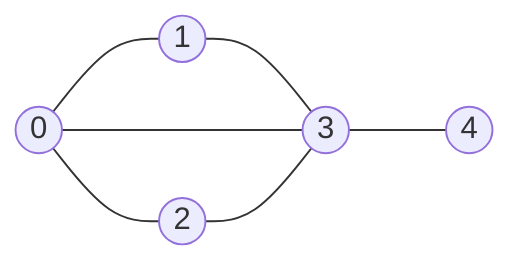
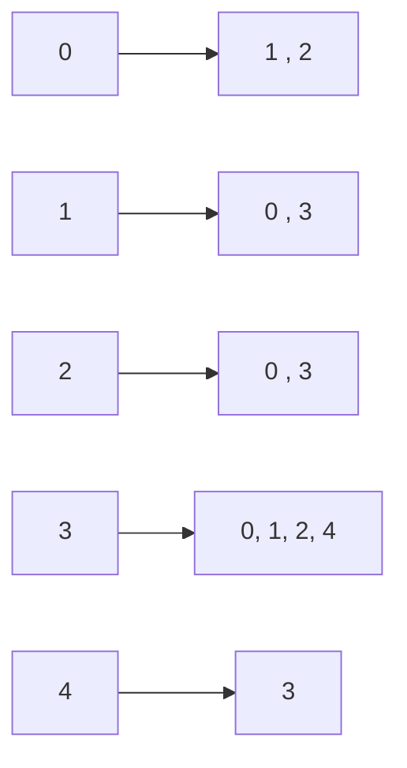

## Adjacency Matrix

$$
A_{ij} =     1  \;\;\; if \ edge(i,j) \\
\;\;\;\;\;\; 0  \;\;\; otherwise 
$$

|      | 0 | 1 | 2 | 3 | 4 |
|----------------------|
 **0** | 0 | 1 | 1 | 1 | 0 |
 **1** | 1 | 0 | 0 | 1 | 0 |
 **2** | 1 | 0 | 0 | 1 | 0 |
 **3** | 0 | 1 | 1 | 0 | 1 |
 **4** | 0 | 0 | 0 | 0 | 1 |

## Edge Set

$$
E = \{(0,1), (0,2), (0,3), (1,3), (2,3), (3,4)\}
$$

Harder to extract information about vertices of the graph => Not that common.

## Adjacency List

- Easy access to neighbours of a node -- useful in graph algorithms.
- Most real world graphs are sparse. That is, large number of nodes with fewer number of edges. For example, in a social network, there could be billions of people (nodes), but each person (node) will only have thousands of edges at most.
