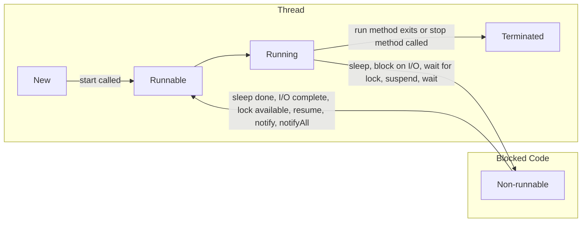

## Creating a thread

Two ways-

1. extend [[lang.java.lib.classes.thread]] class
2. implement [[lang.java.lib.interfaces.runnable]] interface

Implement the `run()` method.

## Executing Threads

- Use `start()` method
- Use [[lang.java.lib.interfaces.executor service]]

## Java Thread Life Cycle

## Thread Scheduler

Task executes for a predefined slice of time and then re-enters pool of ready tasks.

Next task decided based on priority and other factors.

Uses [[execution.scheduling.pre-emptive]] and [[execution.scheduling.time slicing]]
