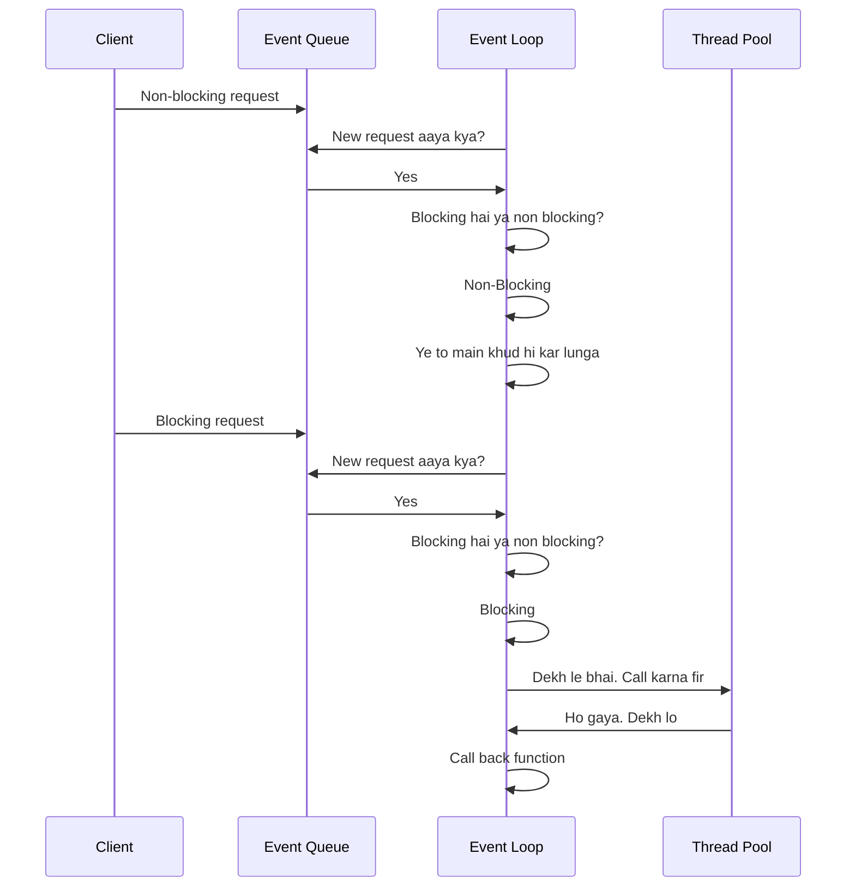

NodeJS is based on Chrome's [[lang.js.v8]]. Initially, [[lang.js]] was intended for use in browser. In the browser, V8 was the compiler for JS. The creator of nodeJS simply made a runtime on top of this V8 engine.

Even though it is single-threaded, nodeJS still allows [[execution.async]] execution via [[paradigm.event driven]] architecture. It uses the [[paradigm.event driven.main loop]] or **event loop** to stay in the memory, while spinning up seperate worker threads for blocking operations. The threads are not created on-demand, but rather fetched from a [[arch.pattern.concurrency.thread pool]].

Non-blocking operations are executed in the main execution itself. The blocking operations are moved to an event queue.

## Flow of a request coming to a node JS server

