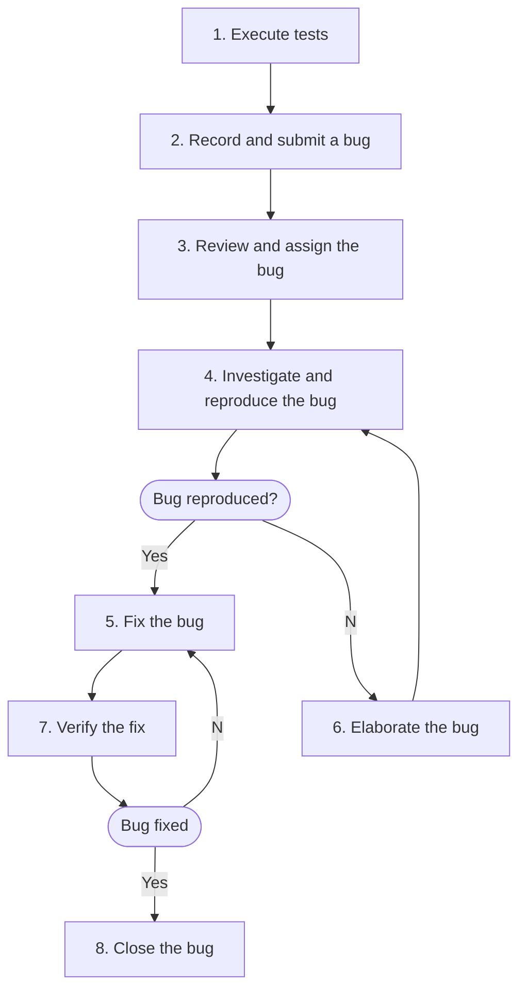

## Bug Workflow

## Bug Life Cycle Stages

1. New/Open
2. Deferred/Postponed
3. Assigned
4. In Progress
5. Fixed
6. Pending Retest
7. Verified/Closed
8. Reopened

These stages can vary according to the organization and team.

## References

[What is Bug Life Cycle In Software Testing? Best Tools For Bug Management](https://katalon.com/resources-center/blog/bug-defect-life-cycle)
